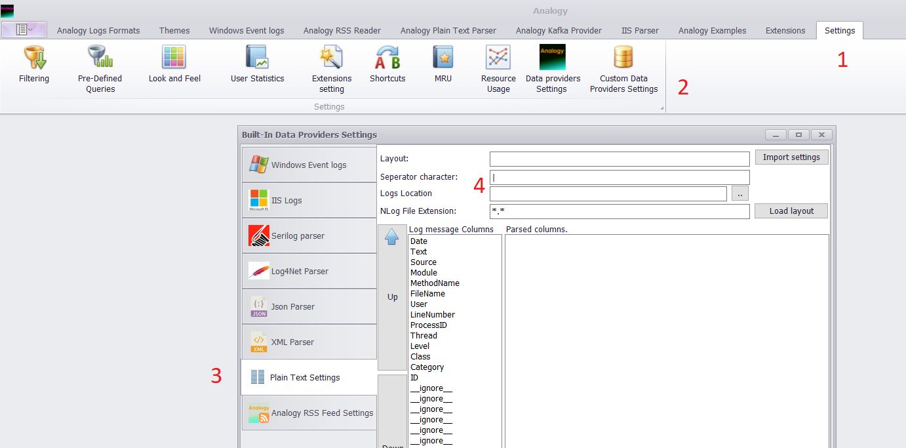
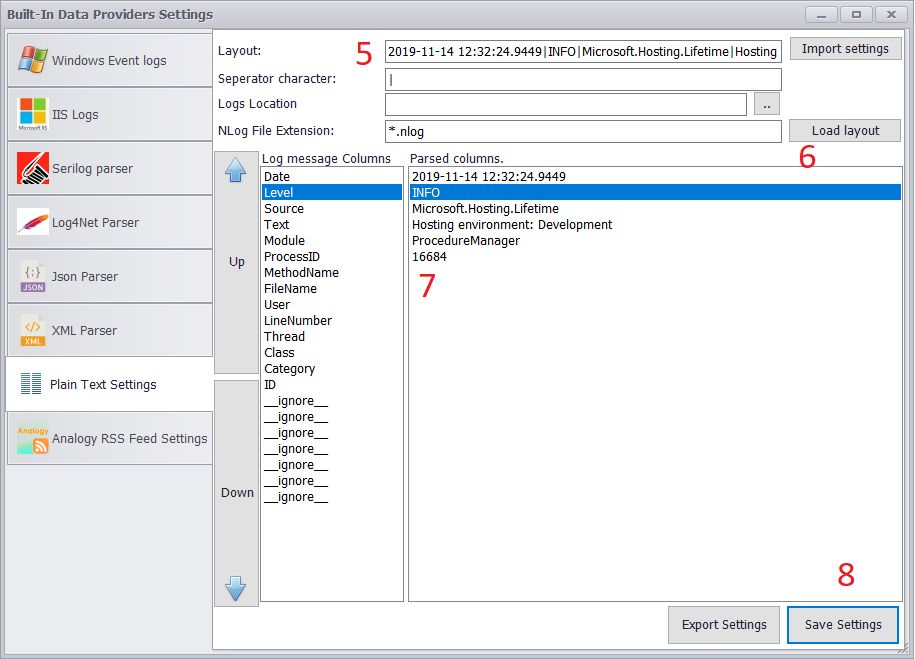
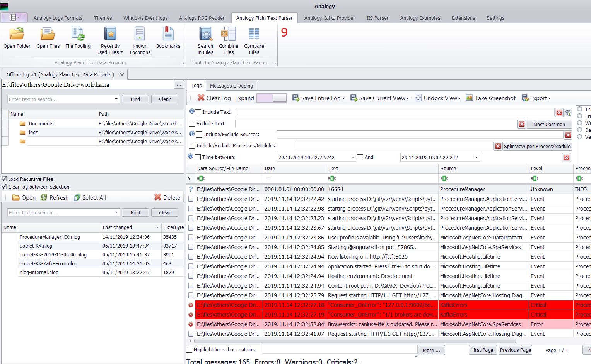

# Analogy Plain Text Parser

 
 

 

plain text parser (can be used to read most logs formats)

for example, to parse simple Nlog files with the following line:

>2019-11-14 12:32:24.9449|INFO|Microsoft.Hosting.Lifetime|Application started. Press Ctrl+C to shut down.|ProcedureManager|16684

>2019-11-14 12:32:24.9449|INFO|Microsoft.Hosting.Lifetime|Hosting environment: Development|ProcedureManager|16684

1. open Analogy and   go to settings window of the parser:
Settings menu --> "Custom Data Provider Settings: --> "plain Text settings":

copy the relevant line, split it (load layout button) and arrange the type to the text:

after saving you can open the log from the "plain text parser tab:

## How To Use
1. Download the latest [Analogy Log Viewer](https://github.com/Analogy-LogViewer/Analogy.LogViewer) from the [release](https://github.com/Analogy-LogViewer/Analogy.LogViewer/releases) section (.net framework or .net Core version).
2. Download (or Compile) this project and put the compiled DLL in the same folder as the Analogy Log Viewer.
